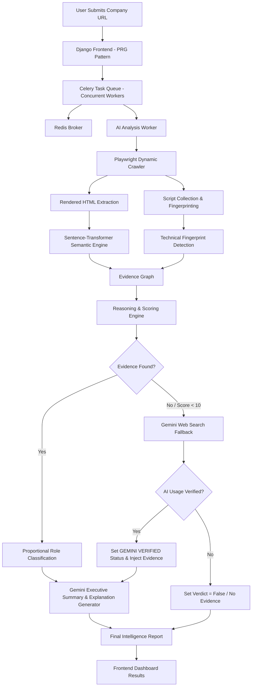
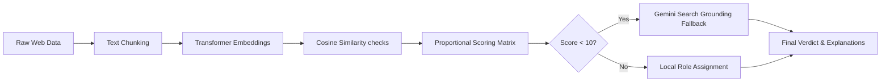
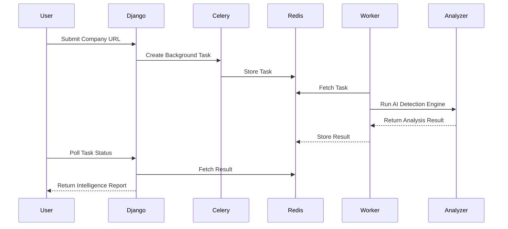

# AI Usage Detection Engine

An intelligent web analysis platform that detects and classifies how organizations use Artificial Intelligence across their products, infrastructure, operations, and public-facing platforms.

The engine performs semantic analysis, technical fingerprinting, behavioral inspection, and organizational reasoning to determine whether a company is:

* AI-Native
* AI Product Company
* AI-Enabled Organization
* AI Governance / Advisory Firm
* AI Research Organization
* AI Marketing Presence

---

# Features

## Intelligent AI Detection

Detects AI adoption signals from:

* Website content
* Product pages
* Technical scripts
* Network requests
* Public AI terminology
* AI infrastructure fingerprints

---

## Semantic Intelligence Engine

Uses transformer-based embeddings to:

* Understand AI-related language
* Detect contextual AI usage
* Reduce keyword-only false positives
* Analyze company positioning

---

## Technical Fingerprinting

Detects:

* OpenAI integrations
* Anthropic usage
* Hugging Face references
* LangChain
* AI SDKs
* AI APIs
* AI model infrastructure

---

## Behavioral Analysis

Inspects runtime browser activity including:

* XHR requests
* Fetch requests
* Websocket activity
* AI endpoint interactions

---

## Organizational Classification

Classifies organizations into categories such as:

* AI-Native
* AI Product Company
* AI Governance / Advisory
* AI-Enabled Enterprise
* AI Research Organization

---

## Async Distributed Scanning

Built with Celery + Redis for:

* Background analysis
* Scalable task execution
* Non-blocking frontend experience
* Real-time polling

---

## Scan History & Persistence

Saves completed intelligence reports to a local SQLite database, allowing users to:
* View a persistent dashboard showing the latest 15 scans.
* Retrieve cached reports instantly with customizable validation check TTLs.
* Avoid redundant scanning and optimize API costs.

---

## Dynamic Crawling Engine

Powered by Playwright:
* Crawls internal subpages and processes JavaScript-heavy content.
* Employs Firefox launch settings matched with custom User-Agent signatures to bypass aggressive server firewalls.
* Automatically filters and avoids high User-Generated Content (UGC) platforms and job boards.

---

## AI Evidence Reasoner (Gemini 2.5)

Integrates Gemini API to:
* Generate natural language explanations for why specific pieces of evidence were chosen.
* Tag each explanation with its source label (**AI Analysis (Gemini 2.5)** vs. **AI Analysis (Local Heuristics)** fallback).
* Create high-quality executive-style summaries of the organization's overall AI adoption.

---

## Gemini Search Grounding Verification Fallback

A secondary validation layer:
* Triggered automatically if the local crawler finds no raw evidence or yields a low confidence score (< 10).
* Queries Gemini with **Google Search Grounding** enabled to check web-wide integrations and partnerships (e.g. Gateless, Tavant).
* Overrides results to **`GEMINI VERIFIED`** and injects search-grounded evidence items directly into the UI dashboard if verified.

---

# Tech Stack

| Layer               | Technology            |
| ------------------- | --------------------- |
| Backend             | Django                |
| Task Queue          | Celery                |
| Broker              | Redis                 |
| Crawling Engine     | Playwright (Firefox)  |
| AI Models           | Gemini 2.5 Flash API  |
| local Embeddings    | Sentence Transformers |
| ML Framework        | PyTorch               |
| Semantic Similarity | scikit-learn          |
| HTML Parsing        | BeautifulSoup         |
| Frontend            | HTML, CSS, JavaScript |

---

# System Architecture



---

# Detection Intelligence Pipeline


---

# Async Processing Flow




# Example Output

```json
{
  "url": "https://www.coderabbit.ai",
  "verdict": true,
  "confidence": "HIGH CONFIDENCE",
  "role": "ai_native",
  "summary": "This organization appears deeply AI-native with strong evidence of AI-powered products and technical AI integrations.",
  "evidence_summary": {
    "semantic": 49,
    "technical": 21,
    "behavioral": 4,
    "organizational": 2
  }
}
```

---

# Screenshots

## Homepage


---

## Live Analysis


---

## Results


---
## Evidence Breakdown


---

# Local Setup

## 1. Clone Repository

```bash
git clone <your-repo-url>
cd ai-usage-detection
```

---

## 2. Configure Environment Variables

Create a `.env` file in the root directory to store your API credentials:

```env
GEMINI_API_KEY=your_gemini_api_key_here
```

---

## 3. Create Virtual Environment

```bash
python -m venv venv
```

---

## 4. Activate Virtual Environment

### Windows

```bash
venv\Scripts\activate
```

### Linux / macOS

```bash
source venv/bin/activate
```

---

## 5. Install Dependencies

```bash
pip install -r requirements.txt
```

---

## 6. Install Playwright Browsers

```bash
playwright install firefox
```

---

## 7. Start Redis

```bash
docker run -d -p 6379:6379 redis
```

---

## 8. Start Celery Worker (Concurrent Threads)

To support concurrent company scanning on Windows, run the Celery worker using thread-based concurrency:

```bash
celery -A config worker --pool=threads -c 4 -l info
```

---

## 9. Start Django Server

```bash
python manage.py runserver
```

---

# Future Enhancements

* Smart crawl prioritization
* Company comparison engine
* PDF export reports
* Real-time crawl visualization
* Industry benchmarking
* Risk scoring
* Enterprise API mode
* Dashboard analytics

---

# Challenges Solved

* Crawling JavaScript-heavy websites
* Async distributed processing
* Reducing AI false positives
* Semantic reasoning over keyword matching
* Evidence normalization
* Dynamic link discovery
* Technical fingerprint detection
* Runtime behavior analysis

---

# Project Goals

This project was built to explore:

* AI adoption intelligence
* Web-scale semantic analysis
* Automated company profiling
* AI infrastructure detection
* Distributed crawling systems
* Evidence-driven reasoning engines

---

# License

MIT License

---

# Author

Aditya Dadasaheb Lawand
