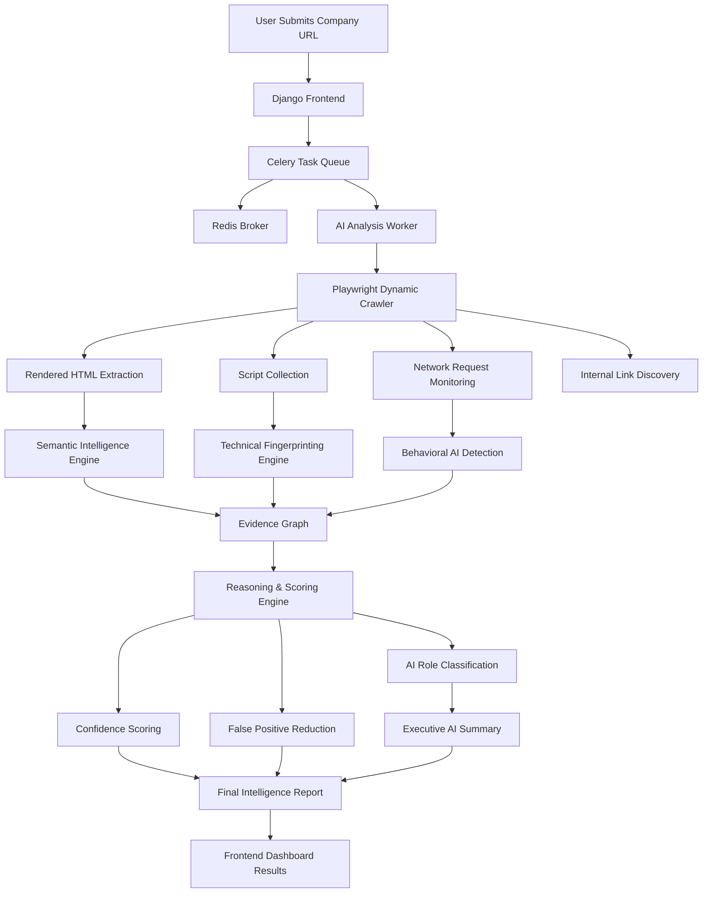
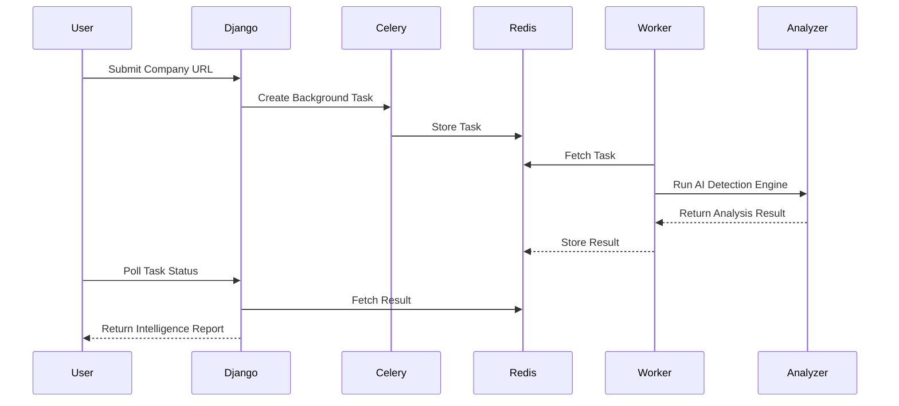

# AI Usage Detection Engine

An intelligent web analysis platform that detects and classifies how organizations use Artificial Intelligence across their products, infrastructure, operations, and public-facing platforms.

The engine performs semantic analysis, technical fingerprinting, behavioral inspection, and organizational reasoning to determine whether a company is:

* AI-Native
* AI Product Company
* AI-Enabled Organization
* AI Governance / Advisory Firm
* AI Research Organization
* AI Marketing Presence

---

# Features

## Intelligent AI Detection

Detects AI adoption signals from:

* Website content
* Product pages
* Technical scripts
* Network requests
* Public AI terminology
* AI infrastructure fingerprints

---

## Semantic Intelligence Engine

Uses transformer-based embeddings to:

* Understand AI-related language
* Detect contextual AI usage
* Reduce keyword-only false positives
* Analyze company positioning

---

## Technical Fingerprinting

Detects:

* OpenAI integrations
* Anthropic usage
* Hugging Face references
* LangChain
* AI SDKs
* AI APIs
* AI model infrastructure

---

## Behavioral Analysis

Inspects runtime browser activity including:

* XHR requests
* Fetch requests
* Websocket activity
* AI endpoint interactions

---

## Organizational Classification

Classifies organizations into categories such as:

* AI-Native
* AI Product Company
* AI Governance / Advisory
* AI-Enabled Enterprise
* AI Research Organization

---

## Async Distributed Scanning

Built with Celery + Redis for:

* Background analysis
* Scalable task execution
* Non-blocking frontend experience
* Real-time polling

---

## Dynamic Crawling Engine

Powered by Playwright:

* Crawls internal pages
* Executes JavaScript-heavy websites
* Extracts rendered content
* Collects scripts and runtime signals

---

## AI Intelligence Summary

Generates executive-style summaries explaining:

* How the organization uses AI
* Whether AI is operational or marketing-oriented
* The confidence level of the analysis

---

# Tech Stack

| Layer               | Technology            |
| ------------------- | --------------------- |
| Backend             | Django                |
| Task Queue          | Celery                |
| Broker              | Redis                 |
| Crawling Engine     | Playwright            |
| AI / NLP            | Sentence Transformers |
| ML Framework        | PyTorch               |
| Semantic Similarity | scikit-learn          |
| HTML Parsing        | BeautifulSoup         |
| Frontend            | HTML, CSS, JavaScript |
| Containerization    | Docker                |

---

# System Architecture



---

# Detection Intelligence Pipeline

```mermaid
flowchart LR

    A[Raw Website Data]
    --> B[Content Cleaning]

    B --> C[Text Chunking]

    C --> D[Sentence Transformer Embeddings]

    D --> E[Semantic Similarity Analysis]

    E --> F[Evidence Classification]

    F --> G[Weighted Reasoning Engine]

    G --> H[AI Adoption Verdict]

    H --> I[Company Role Classification]

    I --> J[Confidence Generation]
```


---

# Async Processing Flow




# Example Output

```json
{
  "url": "https://www.coderabbit.ai",
  "verdict": true,
  "confidence": "HIGH CONFIDENCE",
  "role": "ai_native",
  "summary": "This organization appears deeply AI-native with strong evidence of AI-powered products and technical AI integrations.",
  "evidence_summary": {
    "semantic": 49,
    "technical": 21,
    "behavioral": 4,
    "organizational": 2
  }
}
```

---

# Screenshots

## Homepage


---

## Live Analysis


---

## Results


---
## Evidence Breakdown


---

# Local Setup

## Clone Repository

```bash
git clone <your-repo-url>
cd ai-usage-detection
```

---

## Create Virtual Environment

```bash
python -m venv venv
```

---

## Activate Virtual Environment

### Windows

```bash
venv\Scripts\activate
```

### Linux / macOS

```bash
source venv/bin/activate
```

---

## Install Dependencies

```bash
pip install -r requirements.txt
```

---

## Install Playwright Browsers

```bash
playwright install
```

---

## Start Redis

```bash
docker run -d -p 6379:6379 redis
```

---

## Start Celery Worker

```bash
celery -A config worker --pool=solo -l info
```

---

## Start Django Server

```bash
python manage.py runserver
```

---

# Future Enhancements

* Smart crawl prioritization
* AI-generated intelligence summaries
* Company comparison engine
* PDF export reports
* Scan history persistence
* Real-time crawl visualization
* Industry benchmarking
* Risk scoring
* Enterprise API mode
* Dashboard analytics

---

# Challenges Solved

* Crawling JavaScript-heavy websites
* Async distributed processing
* Reducing AI false positives
* Semantic reasoning over keyword matching
* Evidence normalization
* Dynamic link discovery
* Technical fingerprint detection
* Runtime behavior analysis

---

# Project Goals

This project was built to explore:

* AI adoption intelligence
* Web-scale semantic analysis
* Automated company profiling
* AI infrastructure detection
* Distributed crawling systems
* Evidence-driven reasoning engines

---

# License

MIT License

---

# Author

Aditya Dadasaheb Lawand
